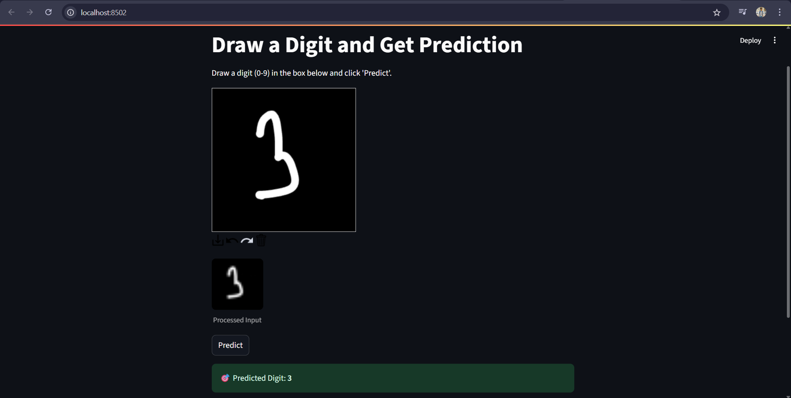

# Digit Recognition using CNN

A Streamlit web app for handwritten digit recognition using a CNN model trained on MNIST dataset.



## Features
- Interactive drawing canvas
- Real-time digit prediction
- Confidence score display

## Installation

1. Clone the repository
2. Install dependencies:
```bash
pip install -r requirements.txt
```

## Usage

Run the app:
```bash
streamlit run app.py
```

Draw a digit (0-9) in the canvas and click "Predict" to see the result.

## Files
- `app.py` - Main Streamlit application
- `mnist_cnn_model.keras` - Trained CNN model
- `requirements.txt` - Python dependencies
